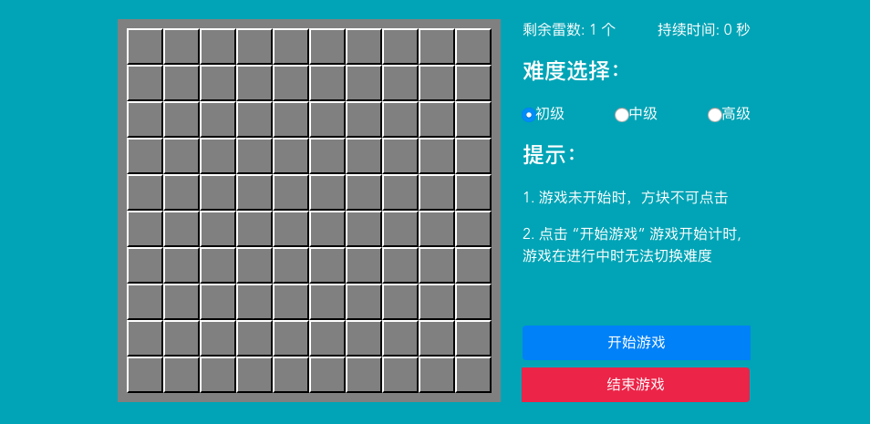
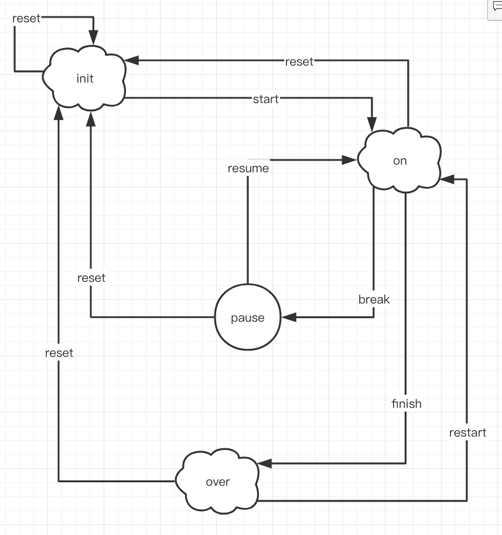

# kill-mine
a classic kill mine game using vuejs



using `finite state machine` design pattern behind the scene:


```js
transitions: [
    {name: 'start', from: 'init', to: 'on'},
    {name: 'reset', from: 'on' ,to: 'init'},
    {name: 'break', from: 'on', to: 'pause'},
    {name: 'finish', from: 'on', to: 'over'},
    {name: 'reset', from: 'pause', to: 'init'},
    {name: 'resume', from: 'pause', to: 'on'},
    {name: 'restart', from: 'over', to: 'on'},
    {name: 'reset', from: 'over', to: 'init'},
    {name: 'reset', from: 'init', to: 'init'}
]
```


### Compiles and hot-reloads for development
```
npm run serve
```
